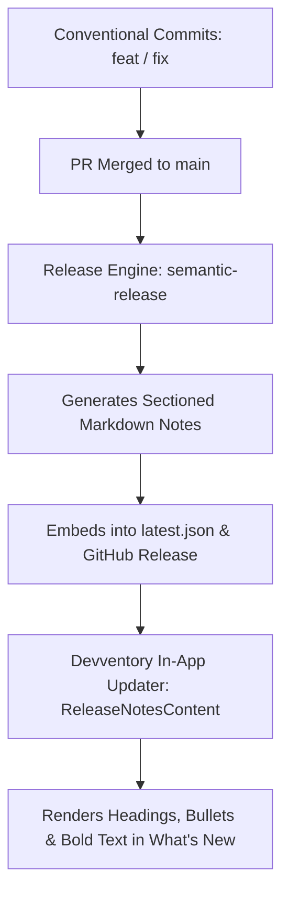

# Automated Release Notes & "What's New" Guide

This guide explains how Devventory automates release notes generation and renders them in the **"What's New"** section under **Settings ? About & Updates**.

---

## 1. How It Works (Fully Automated Flow)



1. **Commit Parsing**: `semantic-release` analyzes commit messages on `main` since the previous release tag.
2. **Release Notes Generation**: `@semantic-release/release-notes-generator` automatically groups commits into sections:
   - `feat:` ? `### Features & Improvements`
   - `fix:` ? `### Bug Fixes`
   - `perf:` ? `### Performance Improvements`
   - `revert:` ? `### Reverts`
   - `docs:`, `chore:`, `ci:`, `test:` ? Hidden from public changelog
3. **Artifact Embedding**: The release engine builds the installer, packages the generated notes into `latest.json`, and uploads them to the public releases repository ([`kuyajp123/devventory-releases`](https://github.com/kuyajp123/devventory-releases)).
4. **In-App Rendering**: Devventory's `ReleaseNotesContent` component parses the markdown from `latest.json` into structured, clean UI elements (bold typography, bullet list items, and monospace code chips) with zero raw markdown syntax displayed.

---

## 2. Daily Development Workflow

To ensure release notes are generated automatically with full details:

### Step 1: Commit using Conventional Commits
Use standard prefixes for your commits:

```bash
# Adding a new capability
git commit -m "feat(vault): inline secret reveal and one-click direct copy"

# Fixing an issue
git commit -m "fix(asset-library): populate tags and notes in edit metadata modal"

# Performance improvement
git commit -m "perf(scanner): optimize file inventory directory traversal"
```

### Step 2: Merge to `main`
- **Rebase & Merge** (or Standard Merge Commit): Preserves all individual feature and bug fix commits so each one gets its own bullet point.
- **Squash & Merge**: If squashing, give the squash commit a descriptive Conventional Commit title (e.g. `feat(vault): add secret reveal, direct copy, and vault auto-centering (#26)`).

### Step 3: Run the Release
Publish the release via either path:

- **Local Release (Maintainer Terminal)**:
  ```powershell
  git checkout main
  git pull origin main
  npm run release:local
  ```
- **Hosted Release**:
  - Automatically triggered by GitHub Actions on push to `main`.

---

## 3. Customizing or Overriding Release Notes (Optional)

If you ever need to manually adjust the notes for an already-published version:
1. Open `latest.json` for that release.
2. Edit the `"notes"` field with your custom Markdown text (e.g. `### Features & Improvements\n- ...`).
3. Replace the `latest.json` asset on the GitHub Release page.
4. Devventory will immediately reflect the updated notes when users click **Check for Updates**.
