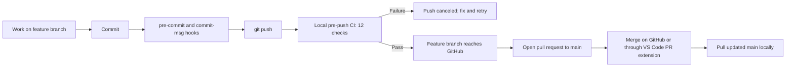

# Devventory Local CI and Protected Main Workflow Manual

**Status:** Current workflow  
**Last verified:** 2026-08-13  
**Primary platform:** Windows PowerShell  
**Repository:** `kuyajp123/devventory`

## Purpose

Devventory runs its routine quality checks on the developer's Windows computer instead of automatically consuming GitHub-hosted Actions minutes. GitHub retains a manual-only workflow for exceptional diagnostics, while a repository-owned Git `pre-push` hook is the normal quality gate.

This manual records:

- how the local CI installation works;
- which checks run and how they are parallelized;
- what happens when a check fails;
- the feature-branch and protected-`main` workflow;
- GitHub and VS Code merge behavior;
- known limitations and troubleshooting;
- the security boundary for the future automated updater-release work.

## Why this workflow was chosen

The previous workflow ran automatically on pushes and pull requests using GitHub-hosted Windows and Ubuntu runners. Those runs exhausted the repository's available GitHub Actions quota.

The current decision is:

1. Run the full quality gate locally before each push.
2. Stop the push when any local check fails.
3. Require pull requests for changes entering `main`.
4. Keep GitHub Actions available only as an explicitly started fallback.
5. Do not make hosted status checks a merge requirement while routine CI remains local.

This is a practical trust model for the current solo-maintainer workflow. It is not a server-enforced proof that every GitHub commit passed CI because local hooks can be absent or bypassed.

## Current workflow at a glance



The local CI runs when `git push` invokes the repository's `pre-push` hook. It does not run merely because a branch was merged on the GitHub website.

## Files that own the setup

| File                       | Responsibility                                                     |
| -------------------------- | ------------------------------------------------------------------ |
| `.githooks/install.mjs`    | Configures this checkout to use the tracked `.githooks` directory. |
| `.githooks/pre-commit`     | Runs `lint-staged` for staged files.                               |
| `.githooks/commit-msg`     | Enforces Conventional Commit messages with commitlint.             |
| `.githooks/pre-push`       | Starts the complete local CI suite before a push.                  |
| `scripts/local-ci.ps1`     | Defines the ordered, fail-fast local checks.                       |
| `package.json`             | Exposes `npm run ci:local` and installs hooks through `prepare`.   |
| `.github/workflows/ci.yml` | Provides the manual-only GitHub-hosted fallback.                   |
| `vitest.config.ts`         | Controls local unit-test workers.                                  |
| `playwright.config.ts`     | Controls E2E parallelism and the local Vite test server.           |

The setup uses Git's native `core.hooksPath` support. Husky was removed after its generated shell wrapper failed in the Windows Git-hook environment before it could run the project commands.

## Preparing a new checkout

Run these commands from the project root:

```powershell
cd C:\Users\Paul\Projects\devventory
npm ci
npm exec playwright install chromium --only-shell
rustup component add clippy rustfmt
cargo install cargo-audit --locked
```

Requirements:

- Node.js 24 or newer;
- npm dependencies installed in `node_modules`;
- Rust toolchain with Clippy and rustfmt;
- Playwright Chromium headless shell;
- `cargo-audit` available on `PATH`.

`npm ci` runs the package `prepare` script, which executes `.githooks/install.mjs` and sets this checkout's local Git configuration:

```text
core.hooksPath=.githooks
```

Each new clone or separate worktree must have the hooks configured. Installing hooks in one checkout does not install them globally.

### Verify hook installation

```powershell
git config --local --get core.hooksPath
```

Expected output:

```text
.githooks
```

If the value is missing or incorrect:

```powershell
npm run prepare
```

Expected output includes:

```text
Configured Devventory local Git hooks.
```

## Complete local quality gate

Run the complete suite manually at any time:

```powershell
npm run ci:local
```

The same command runs automatically through `.githooks/pre-push` when Git has a ref to push.

### Ordered checks

The PowerShell runner executes these stages sequentially and stops at the first failure:

1. `npm run lint`
2. `npm run format:check`
3. `npm run typecheck`
4. `npm run test:unit`
5. `npm run test:release-tools`
6. `npm run test:e2e`
7. `npm run build`
8. `cargo fmt --check` from `src-tauri`
9. `cargo clippy --all-targets --all-features -- -D warnings` from `src-tauri`
10. `cargo test` from `src-tauri`
11. `cargo check` from `src-tauri`
12. `cargo audit` from `src-tauri`

List the configured stages without running them:

```powershell
npm run ci:local -- -ListOnly
```

### Parallel behavior

The 12 top-level stages do not overlap. Individual tools still use internal parallelism:

- Vitest uses up to four workers locally and two when the `CI` environment variable is present.
- Playwright has `fullyParallel: true` and uses the worker count selected for the local machine. The verified run used four workers.
- Cargo parallelizes compilation and Rust tests using its normal worker behavior.

This avoids running separate E2E shards against competing Vite servers while still using multiple CPU cores inside each suite.

### Last verified baseline

The full hook path was verified on 2026-08-13 by running Git's actual `pre-push` hook. Results at that snapshot:

- complete suite: 11/11 stages passed in 8 minutes 30 seconds;
- unit tests: 416 passed and 1 skipped across 92 test files;
- E2E tests: 17 passed using four Chromium workers;
- Rust tests: 112 passed;
- frontend build: passed with the existing Vite large-chunk warning;
- `cargo audit`: exited successfully with 17 allowed warnings.

The test counts, duration, bundle warning, and RustSec advisory count can change as the repository and advisory database evolve. They are a historical baseline, not fixed acceptance values.

## What happens during a push

Run a normal push without `--no-verify`:

```powershell
git push
```

Expected beginning of the output:

```text
Running Devventory local CI before push...
> devventory@0.1.0 ci:local
[1/12] Frontend lint
```

When every check succeeds, Git continues the push. When one check returns a nonzero exit code:

1. the local runner stops immediately;
2. the `pre-push` hook fails;
3. Git cancels the push;
4. no commits from that push are uploaded;
5. fix the reported failure and run `git push` again.

Each push attempt starts a fresh suite. Results are not cached and reused as approval for a later push.

### Safe dry-run verification

This command exercises the real push-hook path without creating a remote branch:

```powershell
git push --dry-run origin HEAD:refs/heads/local-ci-hook-test
```

After it finishes, confirm that no remote branch was created:

```powershell
git ls-remote --heads origin local-ci-hook-test
```

Expected result: no output.

The hook can also be invoked directly, although this does not exercise Git's complete push negotiation:

```powershell
git hook run pre-push -- origin https://github.com/kuyajp123/devventory.git
```

## Routine feature-to-main workflow

### 1. Start from current `main`

```powershell
git switch main
git pull --ff-only
git switch -c feature/<short-feature-name>
```

### 2. Implement and inspect the changes

```powershell
git status --short
git diff
```

### 3. Stage and commit

```powershell
git add <intended-files>
git commit -m "<type>(<scope>): <description>"
```

The commit automatically runs:

- `pre-commit`: lint-staged;
- `commit-msg`: Conventional Commit validation.

Examples:

```text
feat(updater): add automatic update download
fix(search): preserve project filter after refresh
chore(ci): update local quality tooling
```

### 4. Verify the pushed tree is intentional

```powershell
git status --short
git log -1 --oneline
```

Prefer an empty `git status --short` before pushing. Git pushes commits, but the current local runner tests the entire working directory. Uncommitted edits could therefore make the tested files differ from the commit being uploaded.

### 5. Push the feature branch

For its first push:

```powershell
git push -u origin feature/<short-feature-name>
```

For later pushes:

```powershell
git push
```

Every push runs the complete local gate again.

### 6. Open the pull request

Use GitHub's comparison URL:

```text
https://github.com/kuyajp123/devventory/compare/main...feature/<short-feature-name>?expand=1
```

Before creating the pull request, confirm:

- **base:** `main`;
- **compare:** the intended feature branch;
- the latest commit SHA is the commit that passed the local push;
- the commit list includes every intended feature commit;
- the Files changed tab contains no unrelated or secret files.

A pull request includes the complete difference between its base and head branches, not only the latest commit. Merge style changes the commit history presentation but not the intended combined file content:

- **Create a merge commit:** retains feature commits and adds a merge commit.
- **Squash and merge:** creates one combined commit on `main`.
- **Rebase and merge:** replays the feature commits onto `main` with new commit SHAs.

### 7. Merge the pull request

Preferred options:

- merge using the GitHub pull-request page; or
- merge using VS Code's GitHub Pull Requests extension.

Both options satisfy the protected branch's pull-request rule.

GitHub performs this merge remotely. The local `pre-push` hook does not run again at the moment GitHub creates the merge. The quality evidence is the successful push of the feature branch.

### 8. Synchronize local `main`

```powershell
git switch main
git pull --ff-only
```

`git pull` does not run the `pre-push` hook because it is not a push.

### If `main` changes before the PR is merged

Update the feature branch locally, resolve any integration issues, and push it again so the updated branch receives a fresh local CI run:

```powershell
git switch feature/<short-feature-name>
git fetch origin
git merge origin/main
git push
```

## Protected `main` ruleset

The intended GitHub ruleset is:

```text
Ruleset name: Protect main
Enforcement: Active
Branch target: Default branch
Bypass actor: Repository administrator
Rules:
  - Restrict deletions
  - Require a pull request before merging
  - Block force pushes
```

### Effect of each rule

- **Restrict deletions:** prevents accidental deletion of `main`, except through an allowed bypass.
- **Require a pull request before merging:** prevents ordinary direct updates to `main`; a pull request must be opened. It does not require approval unless an approval count is separately configured.
- **Block force pushes:** prevents rewriting `main` history.
- **Default branch target:** protects whichever branch GitHub currently designates as the repository's default, expected to be `main`.

### Administrator bypass

GitHub rulesets can grant the administrator either:

- **Always allow:** the administrator can bypass the rules, including direct pushes to `main`;
- **For pull requests only:** the administrator must still open a PR but can choose to bypass protections within that PR.

Use **For pull requests only** when the goal is to prevent accidental direct pushes while retaining emergency merge authority.

### Interaction with local CI

The listed rules do not require a GitHub status check, so the absence of an automatic hosted Actions run does not leave a required check permanently pending.

The ruleset also does not prove that local CI ran. Local enforcement depends on:

- the checkout having `.githooks` installed;
- the push being made without `--no-verify`;
- the developer not changing files during the run;
- the feature branch actually being pushed before it is merged.

## VS Code behavior

### Source Control commit

Committing through VS Code uses Git and should invoke the tracked `pre-commit` and `commit-msg` hooks.

### Sync Changes

VS Code's **Sync Changes** normally pulls remote updates and then pushes local commits. The local `pre-push` hook runs during the push portion.

Important edge case: Sync may pull and change local files before the push hook begins. If another local CI run is already testing the checkout, the files under test can change during that earlier run.

### Concurrent pushes or manual CI runs

The current runner has no single-process lock. If local CI is already running and another push begins, a second complete suite may run concurrently. The current decision is to allow this because each push should validate its own current changes.

Possible contention includes:

- Playwright's Vite server and port `1422`;
- the frontend `dist` directory;
- Cargo's shared `target` directory;
- CPU and memory pressure.

If a concurrent run fails in an unusual way, wait for the other run to finish and retry the push before diagnosing it as an application regression.

### Merge Branch in Source Control

Using VS Code's ordinary **Merge Branch** command while checked out on `main` performs a local merge. Pushing that result is a direct update to `main` and should be blocked by the pull-request rule unless the administrator has an **Always allow** bypass.

Use the GitHub comparison page or VS Code's GitHub Pull Requests extension for the routine protected-branch workflow.

## Manual GitHub Actions fallback

`.github/workflows/ci.yml` has only the `workflow_dispatch` trigger. Pushes and pull requests do not start it automatically after that configuration is present on the applicable GitHub branch.

To start it deliberately:

1. Open the repository's **Actions** tab.
2. Select **Manual CI fallback**.
3. Select **Run workflow**.
4. Choose the intended branch and confirm.

This run consumes GitHub-hosted Actions resources.

The manual hosted workflow is a fallback, not the authoritative mirror of the local script. At the current snapshot it does not explicitly run `npm run format:check` or `cargo fmt --check`, while the local 11-stage suite does.

## Bypasses and limitations

### `--no-verify`

This command bypasses `pre-push`:

```powershell
git push --no-verify
```

Reserve it for a deliberate emergency. If it is used, run `npm run ci:local` separately and record why the normal gate was bypassed.

### No server-side local-CI status

GitHub does not receive a success status from the local script. Consequently:

- GitHub cannot display the local result as a required check;
- GitHub website merges do not rerun the suite;
- another machine without installed hooks can push without running it;
- administrator bypass permissions can still override the branch ruleset.

If multiple untrusted contributors begin pushing, reconsider a self-hosted runner or another server-visible status mechanism.

### No automatic release

The current CI gate validates source code only. It does not:

- calculate a release version;
- build signed updater artifacts;
- generate `latest.json`;
- create a tag;
- publish a GitHub Release.

Those tasks remain future release-automation work.

## Troubleshooting

### Push does not show the local CI banner

Check the active hook path:

```powershell
git config --local --get core.hooksPath
```

If needed:

```powershell
npm run prepare
```

Also confirm that the branch has at least one commit/ref update to push. A branch that is already synchronized may simply report that everything is up to date.

### Frontend dependencies are missing

```powershell
npm ci
```

### Playwright cannot find Chromium

```powershell
npm exec playwright install chromium --only-shell
```

### Rust commands are missing

```powershell
rustup component add clippy rustfmt
cargo install cargo-audit --locked
```

### `cargo audit` prints warnings but exits successfully

Review the advisory list and exit code. The last verified snapshot reported 17 allowed warnings, primarily inherited GTK3/UNIC maintenance advisories plus the `glib 0.18.5` unsoundness advisory. A changed warning count or a nonzero exit requires a fresh dependency assessment.

### A check fails

Capture and report:

1. the `[n/12]` stage name;
2. the exact command and first relevant error;
3. the final exit code;
4. `git status --short`;
5. relevant Node/npm/Rust versions;
6. whether another local CI, Vite, Playwright, Cargo, or Sync operation was running.

Never include signing-key contents, signing passwords, GitHub tokens, `.env` values, or other secrets in the report.

## Automated updater-release handoff

Release automation is implemented separately from routine CI. Feature-branch pushes still use local pre-push checks and do not consume Actions minutes. The hosted release workflow runs only when `main` changes or a maintainer explicitly retries it with `workflow_dispatch`.

The default hosted path and local fallback share one recovery-first release engine. See the [Dual-Path Release Workflow Manual](./dual-path-release-workflow-manual.md) for setup and operation.

Routine push/PR CI remains local. Only the production release job deliberately uses GitHub-hosted resources after protected `main` changes.

### Release automation must eventually perform

1. Confirm `main` is clean, current, and trusted.
2. Run or require the complete quality gate.
3. Determine the next SemVer from Conventional Commit history.
4. Hand the exact version to `package.json`, Tauri configuration, and Rust package metadata as required.
5. Build the signed Windows x86_64 NSIS installer.
6. Verify the versioned `.exe` and `.sig` files exist and match the intended release.
7. Generate `latest.json` using the complete signature and the final public asset URL.
8. Validate all release metadata before publishing anything.
9. Publish the GitHub Release and its intended assets to `kuyajp123/devventory-releases`.
10. Verify `latest.json` and the installer are anonymously accessible.
11. Confirm an older installed Devventory detects and installs the automated release.
12. Ensure any failure cannot leave a broken or incomplete release marked as latest.

### Release credential separation

These credentials have different purposes and must never be confused:

- **Tauri updater private key:** signs updater artifacts and stays outside the repository.
- **Tauri signing-key password:** the user-created password that unlocks that private key. It is not a GitHub token.
- **GitHub authentication/token:** authorizes creating tags/releases and uploading assets. It does not unlock the Tauri signing key.

Never commit, print, document, or upload the private key, its password, or a GitHub token. Only public updater signatures and the configured public verification key belong in release metadata/application configuration.

### Existing release invariants to preserve

- Public updater repository: `kuyajp123/devventory-releases`.
- Windows updater platform key: `windows-x86_64`.
- Published installer, signature, and `latest.json` must agree on the same version.
- `latest.json` must contain the full `.sig` contents.
- Release asset URLs must point to the final versioned GitHub Release.
- Previously published releases such as `v0.1.1` must not be modified.
- The signing identity must not be rotated casually because installed applications trust its public key.
- Release automation must not redesign the Phase 2 updater user experience.

Detailed release requirements remain in:

- [`devventory-updater-master-implementation-plan.md`](./devventory-updater-master-implementation-plan.md)
- [`devventory-updater-phase-2-detailed-implementation-plan.md`](./devventory-updater-phase-2-detailed-implementation-plan.md#55-handoff-to-phase-3)

## External references

- [Git `pre-push` hook](https://git-scm.com/docs/githooks#_pre_push)
- [Git `core.hooksPath`](https://git-scm.com/docs/git-config#Documentation/git-config.txt-corehooksPath)
- [GitHub rules available for rulesets](https://docs.github.com/en/repositories/configuring-branches-and-merges-in-your-repository/managing-rulesets/available-rules-for-rulesets)
- [Creating repository rulesets and bypass permissions](https://docs.github.com/en/repositories/configuring-branches-and-merges-in-your-repository/managing-rulesets/creating-rulesets-for-a-repository)
- [GitHub `workflow_dispatch`](https://docs.github.com/en/actions/reference/workflows-and-actions/events-that-trigger-workflows#workflow_dispatch)
- [Playwright parallelism](https://playwright.dev/docs/test-parallel)
- [Vitest `maxWorkers`](https://vitest.dev/config/maxworkers)
- [semantic-release configuration](https://semantic-release.gitbook.io/semantic-release/usage/configuration)
